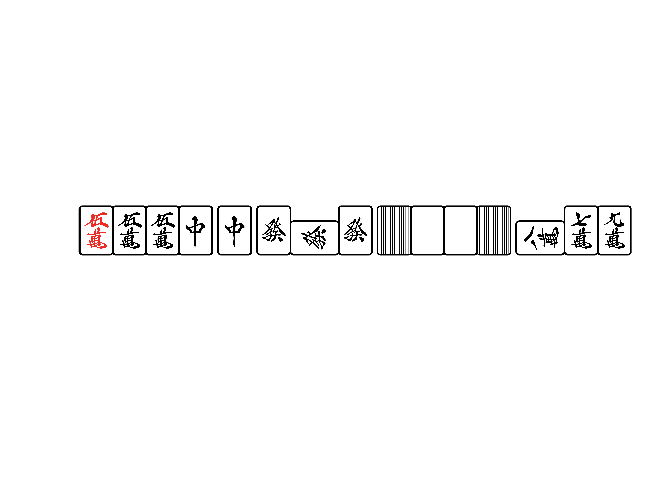

<!-- README.md is generated from README.Rmd. Please edit that file -->

# shikakusphere

<!-- badges: start -->

[](https://paithiov909.r-universe.dev/shikakusphere)
[](https://github.com/paithiov909/shikakusphere/actions/workflows/R-CMD-check.yaml)
<!-- badges: end -->

shikakusphere is a collection of miscellaneous funcitons for Japanese
mahjong that wraps C++ sources derived from
[tomohxx/shanten-number](https://github.com/tomohxx/shanten-number) and
[TadaoYamaoka/cmajiang](https://github.com/TadaoYamaoka/cmajiang).

The name “shikakusphere” is a compound word of “shikaku” + “sphere”.
“shikaku” means “square” in Japanese. It comes from “Shikakui Uchuu De
Matteru Yo”, which is the third ED of the anime “Saki”, and sounds
exactly like mahjong games.

## Installation

You can install the development version of shikakusphere from
[GitHub](https://github.com/) with:

``` r
# install.packages("pak")
pak::pak("paithiov909/shikakusphere")
```

## Example

### 手牌の表現

手牌は[kobalab/majiang-core](https://github.com/kobalab/majiang-core)の記法で文字列として表現します。

**参考**

- [牌 · kobalab/majiang-core
  Wiki](https://github.com/kobalab/majiang-core/wiki/%E7%89%8C)
- [面子 · kobalab/majiang-core
  Wiki](https://github.com/kobalab/majiang-core/wiki/%E9%9D%A2%E5%AD%90)
- [牌姿 · kobalab/majiang-core
  Wiki](https://github.com/kobalab/majiang-core/wiki/%E7%89%8C%E5%A7%BF)
- [電脳麻将のプログラム中の中国語一覧 -
  koba::blog](https://blog.kobalab.net/entry/20170722/1500688645)

`paistr()`は、こうした手牌の文字列表現を扱いやすくするためのS3クラス（`<skksph_paistr>`）です。`print()`したときに、その文字列に含まれる牌の枚数を表示します。また、`plot(<skksph_paistr>)`で牌姿を画像としてプロットできます。

``` r
library(shikakusphere)

hands <- c(
  "m11p234s555z11122*",
  "p1122334455667",
  "m19p19s19z1234567",
  "m055z7z7,m78-9,z5555,z666=",
  "m055z7z7,m78-9,z5555,z666=,"
)

hands <- paistr(hands)
hands
#> <skksph_paistr[5]>
#> [1] <13>'m11p234s555z11122*'          <13>'p1122334455667'             
#> [3] <13>'m19p19s19z1234567'           <15>'m055z7z7,m78-9,z5555,z666=' 
#> [5] <15>'m055z7z7,m78-9,z5555,z666=,'

plot(hands[4])
```



`<skksph_paistr>`を`print()`したときに表示される牌の枚数は不正確な場合があります。手牌の表現にどの牌が何枚含まれるかを正確に確認するには、`tidy(<skksph_paistr>)`を使うことができます。

``` r
tidy(hands)
#> # A tibble: 41 × 3
#>       id tile      n
#>    <int> <fct> <int>
#>  1     1 m1        2
#>  2     1 p2        1
#>  3     1 p3        1
#>  4     1 p4        1
#>  5     1 s5        3
#>  6     1 z1        3
#>  7     1 z2        2
#>  8     2 p1        2
#>  9     2 p2        2
#> 10     2 p3        2
#> # ℹ 31 more rows
```

このかたちの表現は`lineup()`でlist of factorsにすることができます。

``` r
tidy(hands) |>
  lineup()
#> [[1]]
#>  [1] m1 m1 p2 p3 p4 s5 s5 s5 z1 z1 z1 z2 z2
#> 37 Levels: m0 m1 m2 m3 m4 m5 m6 m7 m8 m9 p0 p1 p2 p3 p4 p5 p6 p7 p8 p9 ... z7
#> 
#> [[2]]
#>  [1] p1 p1 p2 p2 p3 p3 p4 p4 p5 p5 p6 p6 p7
#> 37 Levels: m0 m1 m2 m3 m4 m5 m6 m7 m8 m9 p0 p1 p2 p3 p4 p5 p6 p7 p8 p9 ... z7
#> 
#> [[3]]
#>  [1] m1 m9 p1 p9 s1 s9 z1 z2 z3 z4 z5 z6 z7
#> 37 Levels: m0 m1 m2 m3 m4 m5 m6 m7 m8 m9 p0 p1 p2 p3 p4 p5 p6 p7 p8 p9 ... z7
#> 
#> [[4]]
#>  [1] m0 m5 m5 m7 m8 z5 z5 z5 z5 z6 z6 z6 z7 z7
#> 37 Levels: m0 m1 m2 m3 m4 m5 m6 m7 m8 m9 p0 p1 p2 p3 p4 p5 p6 p7 p8 p9 ... z7
#> 
#> [[5]]
#>  [1] m0 m5 m5 m7 m8 z5 z5 z5 z5 z6 z6 z6 z7 z7
#> 37 Levels: m0 m1 m2 m3 m4 m5 m6 m7 m8 m9 p0 p1 p2 p3 p4 p5 p6 p7 p8 p9 ... z7
```

さらに、このかたちのlist of factors（またはlist of
characters）は`lipai()`で文字列表現に変換できます（ただし、`lipai()`では`_*+=-,`は扱えません）。

``` r
c(paste0("m", 1:9), paste0("s", 4:6), paste0("z", c(1, 1))) |>
  lipai()
#> [1] "m123456789s456z11"
```

### シャンテン数・有効牌の確認

このパッケージで使用している実装における「シャンテン数」は、大まかには「その手牌を和了形（聴牌形）に変形させるために必要なツモの最小数」のことを指しています。そのため、少牌だったりして素朴な意味での和了形になっていないかたちであっても、n面子1雀頭のかたちになってさえいれば、ここでのシャンテン数は`-1`を返します。

また、ここでの「有効牌」というのは、その牌を新たにツモったときに、この意味でのシャンテン数が減少する牌のことです。手牌の枚数が14,
11, 8, 5,
2枚の場合や、すでに和了形であって有効牌が定義できないときには、`character(0)`を返します。ただし、打牌可能な手牌のなかに4枚ある場合についてのみ、有効牌であっても待ち牌としません。

``` r
# シャンテン数
n_xiangting <- calc_xiangting(hands)
n_xiangting
#> # A tibble: 5 × 2
#>     num mode  
#>   <int> <fct> 
#> 1     0 yiban 
#> 2     0 qidui 
#> 3     0 guoshi
#> 4    -1 yiban 
#> 5     0 yiban

# 有効牌
collect_tingpai(hands[n_xiangting$num >= 0])
#> Warning in skksph_get_tingpai(pai, index_s, index_h): zimo must be empty at:
#> m055z77,m78-9,z5555,z666=,
#> [[1]]
#> [1] "m1" "z2"
#> 
#> [[2]]
#> [1] "p1" "p4" "p7"
#> 
#> [[3]]
#>  [1] "m1" "m9" "p1" "p9" "s1" "s9" "z1" "z2" "z3" "z4" "z5" "z6" "z7"
#> 
#> [[4]]
#> character(0)
collect_tingpai(c("m1234444p456s789", "m13p456s789z11,m2222"))
#> [[1]]
#> [1] "m1"
#> 
#> [[2]]
#> [1] "m2"
```

### 得点・あがり役の確認

`calc_defen()`はvectorizeされていないため、必ず、長さが1の文字列表現を渡してください。

``` r
# 得点
score <- calc_defen(hands[n_xiangting$num == -1][1], baopai = "z1")
score
#>                      shoupai        hupai fu fanshu damanguan defen menfeng
#> 1 m055z7z7,m78-9,z5555,z666= 8,9,34,35,12 70      7         0 12000       1

# ロン和了のときはこんなふうに書く
calc_defen("m345567p234s3378", baopai = "z1", rongpai = "s9=")
#>               shoupai hupai fu fanshu damanguan defen menfeng
#> 1 m345567p234s3378s9=    22 30      1         0  1000       1

# あがり役の表示
parse_hupai(score$hupai, "jp")
#> [[1]]
#> [1] 翻牌 白 翻牌 發 小三元  混一色  赤ドラ 
#> 54 Levels: 場風 東 場風 南 場風 西 場風 北 自風 東 自風 南 自風 西 ... 地和
```

# License

GPL (\>= 3). This package contains the
[tinyxml2](https://github.com/leethomason/tinyxml2) code released under
the zlib license.
